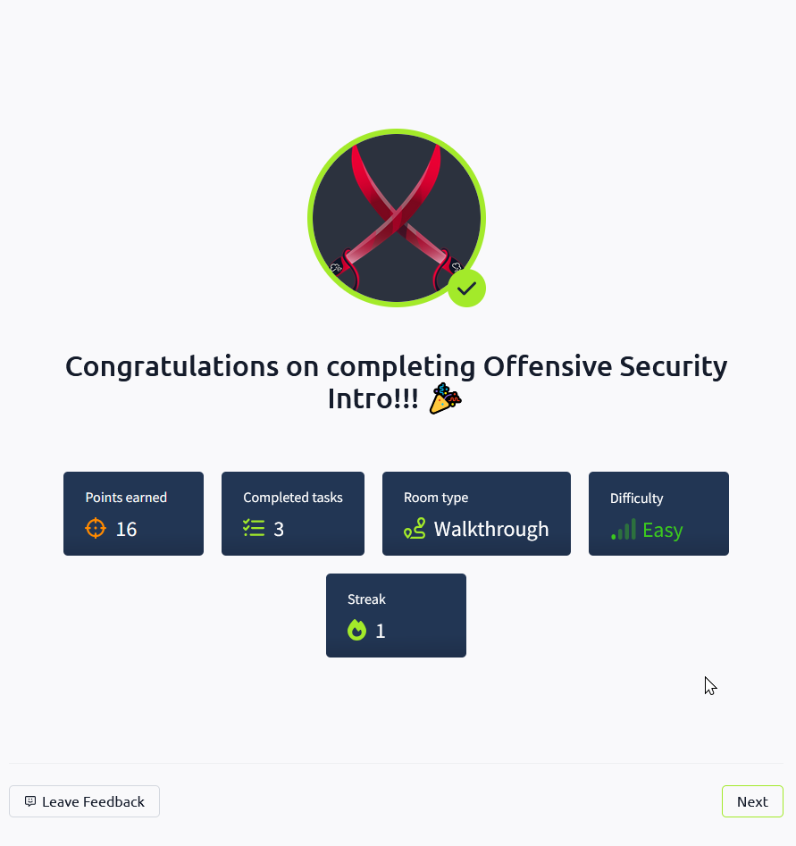

# TryHackMe – Introduction to Offensive Security

**Room Link:** https://tryhackme.com/room/offensivesecurityintro 
**Completion Date:** April 12, 2025

---

## Summary

This was my first room on TryHackMe. It introduced the offensive side of cybersecurity and covered topics like:

- Ethical hacking roles
- Penetration testing process
- The Goal of Offensive Hacking

---

## What I Learned

- A basic overview and practical example of offensive security

---

## Proof of Completion

---

## Notes

- I like how the room broke down intimidating concepts into approachable parts.
- I’m interested in exploring red teaming and pentesting further.
- I want to dive into more hands-on exercises next.

---

*This file is part of my self-study journey into cybersecurity, where I’m tracking each room, what I learned, and how I’m growing week-by-week.*
